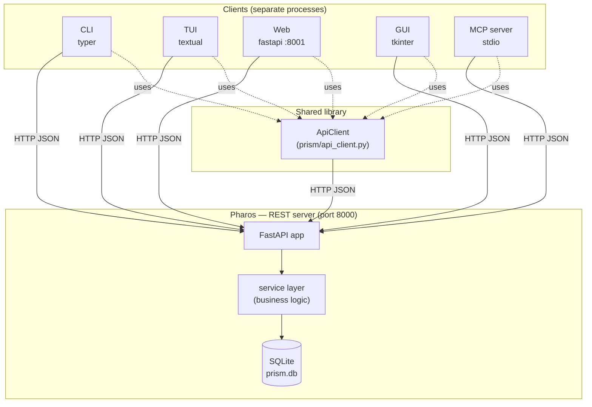
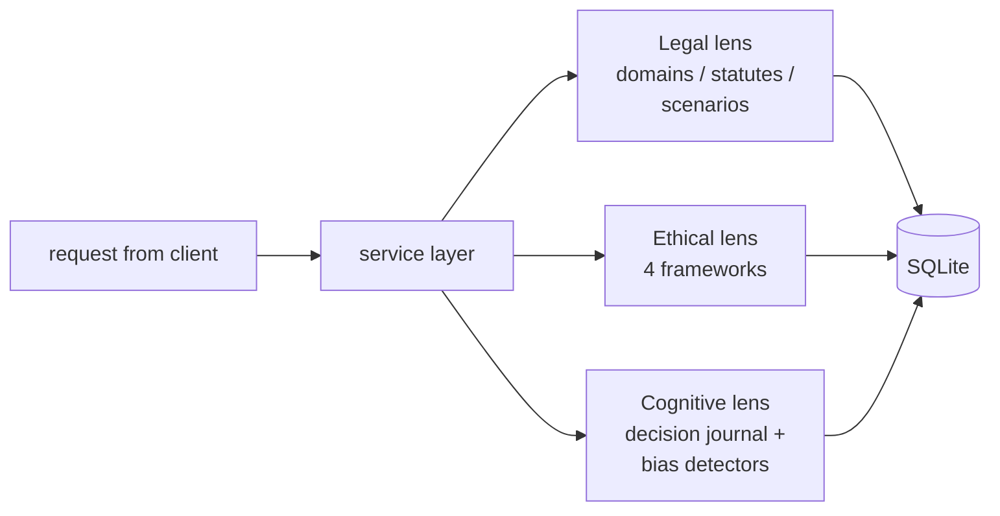

# Architecture

This document explains how Prism is built. For *what* it does, see `spec.md`.

## Big picture

Prism follows the same client-server pattern as HW3: one process owns the data, every other process is a thin client that talks to it over HTTP.



## Why this shape?

**One source of truth.** Pharos owns the SQLite file. No client ever opens the DB directly. This means we can change the storage (Postgres, JSONL, anything) without touching any client.

**One API client.** Every client imports the same `ApiClient`. Adding an endpoint means adding one method here and every client gets it automatically. Tests use the same client via an in-process fixture.

**Independent processes.** You can run only the CLI without bringing up the GUI. Tests can spin up the server in a thread without launching any UI.

## Three lenses, one engine

The "three lenses" idea (legal / ethical / cognitive) is implemented in the **service layer**, not split into three separate services. The reason: most user actions touch more than one lens at once. E.g., "log a decision about my landlord" hits cognitive (journal entry), legal (link to tenant domain), and potentially ethical (analysis of the dilemma).



## Directory layout

```
prism/
├── pyproject.toml
├── README.md
├── docs/
│   ├── spec.md              ← what it does
│   ├── architecture.md      ← this file
│   ├── testing.md           ← test strategy
│   └── domains/             ← per-domain notes (Illinois law research)
├── src/prism/
│   ├── __init__.py
│   ├── db.py                ← schema + connection
│   ├── models.py            ← Pydantic models
│   ├── service.py           ← business logic
│   ├── server.py            ← Pharos: FastAPI app
│   ├── api_client.py        ← shared HTTP wrapper
│   ├── cli.py               ← Typer CLI
│   ├── tui.py               ← Textual app
│   ├── web.py               ← FastAPI web UI (port 8001)
│   ├── gui.py               ← Tkinter desktop app
│   ├── mcp_server.py        ← MCP server (stdio)
│   ├── lenses/
│   │   ├── legal.py         ← scenario/statute queries
│   │   ├── ethical.py       ← framework analyzer
│   │   └── cognitive/
│   │       ├── journal.py   ← decision CRUD
│   │       └── biases.py    ← detector rules
│   └── seed/                ← initial content (statutes, scenarios)
│       ├── tenant.py
│       ├── employment.py
│       └── ...
├── tests/
│   ├── conftest.py          ← auto-mark by folder
│   ├── unit/
│   ├── contract/
│   └── integration/
└── .claude/
    └── skills/
        ├── add-scenario/SKILL.md
        └── bias-audit/SKILL.md
```

## Request lifecycle (example)

User runs `prism-cli rights tenant deposit`:

1. CLI parses args via Typer.
2. CLI calls `ApiClient.get_scenario("deposit-not-returned")`.
3. ApiClient sends `GET /scenarios/deposit-not-returned` to Pharos.
4. FastAPI routes to `server.get_scenario(slug)`.
5. Handler calls `service.scenarios.get_by_slug(slug)`.
6. Service queries SQLite, joins statutes, returns dict.
7. FastAPI serializes via Pydantic, returns JSON.
8. ApiClient deserializes, returns model object.
9. CLI renders to terminal with rich tables.

## Why FastAPI for both server and web client?

The Pharos server speaks JSON only — it's an API. The web client (`prism-web`) is a separate FastAPI app on port 8001 that renders HTML pages, calling Pharos for data. Running them as separate processes:
- proves the architecture is real (web client genuinely doesn't touch the DB)
- lets you run one without the other
- mirrors how a production system would work

## Testing the architecture

`make_in_process_client()` (in `tests/conftest.py`) builds an `ApiClient` that talks to a FastAPI `TestClient` instead of a real HTTP socket. This means integration tests can use the same client code as production with no network overhead.

See `testing.md` for the test layering strategy.
